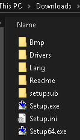
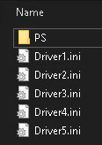

# Replace Active Directory GPO Printer Deployment
The absolute easiest way to deploy printers is via group policy.

Microsoft ruined that luxury during the PrintNightmare fiasco with slapping `wontfix` onto the series of bugs related to the antiquated spooling system of Windows (the subject of the numerous CVEs).

- There are [workarounds](https://theitbros.com/allow-non-admins-install-printer-drivers-via-gpo/) to retaining GPO deployment
  - If you can get these to work in your environment, by all means, use them

Despite potential workarounds, many of us still encountered inexplicable issues going that route.

Additionally, some subsequent patches appear to have even broken the workaround.  Rather than revoking cumulative security patches, it's best to abandon the GPO approach of printer deployment.

## Mass Deployment of Printers
Those of us with a fleet of machines do not want to distribute queues or drivers by USB.  We also don't want to give end users administrator privileges, or instruct non-techy types to run a batch script from their desktop.

After exploring and experimenting with different approaches, going the old fashioned way seemed to be the most efficient and hands-free route.

### Scenario
We have a mixed environment where there are a *lot* of machines that are multi-user.  Globally enumerating printers should have been the solution - but it simply didn't work (when deploying the scripts via MDM) - the problem seems to plausibly be a combination of things:
- As of Windows 10, Microsoft insists on user installation of printers
- Running the deployment script via MDM runs as `SYSTEM` - this particular session doesn't write the spots the printui tool needs access to

### Solution
Use built-in visual basic script tools from Windows 10:
```batch
C:\WINDOWS\system32\Printing_Admin_Scripts
```
- [These tools date back as far as Windows 7](https://community.spiceworks.com/how_to/71708-how-to-install-printer-driver-and-add-a-network-printer-from-the-command-line) - Concise tutorial on Spiceworks, by Paul9469; may be useful if you don't need the layered approach I reference in my notes


***
***

## Get Your Driver Info
- I use Papercut as my print server
- It assumes the user logs on using their Active Directory account, which is synced to Papercut
  - Unique queues are not taken into consideration; the logged on user is what "prints"
- At the time of writing, all clients are on 21H1

We do not use Print Deploy from Papercut, as we require advanced features of the printer drivers, which are not included in Papercut's implementations, yet.

- Open **Print Manager**
- Obtain your **Driver Name** from the *Printer* list
  - My driver type for all drivers is **Type 3 - User Mode** - if yours differ you may (or may not) have issues

For good measure, I went to the manufacturer's site for the printers and downloaded the latest copy of the drivers and unzipped them onto my testing Windows machine.
- The drivers came in a 500MB+ zip
- After extracting, I went into the extracted directory and inspected the format, I particularly only cared about the **Drivers** directory:
    - 

    - Inside the **Drivers** directory, there were the following sub-folders (which I *deleted*, as I do not need them for my use-case; if you're unsure if you need them, best to leave them):
      - FAX
      - PCL

    That left only the following:
    - 
    - PS / postscript drivers and the ini / config files.

## Deploy the Drivers via MDM
What used to take place between the client machine, GPO & print server, will now be partially handled by MDM.  I use MDM to deploy the drivers, so there's no mucking about with imaging or temporary admin nonsense. (Non-admins can't install printer drivers) - with this approach, there is no UAC and zero involvement from the end-user.

- Deploy the drivers in the following directory:
  - `C:\Users\Public\AppData\Local\PrinterDrivers`
    - For each individual driver, create a sub-folder like "Color" or "BW" and upload the related driver to that directory
      - Such will be referenced later in the scripts - pay attention to case

Now your driver files are set and ready to be called upon, later.

## Find the Setup File / .inf
Inside the `PS` directory (assuming you're deploying the same way) you'll find a single .inf file.  In my case, I'm using Konica Minolta drivers, so I see:
```batch
KOAXPA__.INF
```
on the client machine (after deployment of the drivers), which is in the following location:
```batch
C:\Users\Public\AppData\Local\PrinterDrivers\Color\Drivers\PS\EN\Win_x64\KOAXPA__.INF
```
- Make note of this path, as it will be called upon in a script

## Deploy the Scripts
The meat and potatoes of this, aside from your drivers, are just two scripts:
- [login-script/setup-queues.bat](login-script/setup-queues.bat)
  - Details/instructions: [readme](login-script/README.md)
- [mdm-driver-deploy/setup-ports.bat](mdm-driver-deploy/setup-ports.bat)
  - Details/instructions: [readme](mdm-driver-deploy/README.md)

### Deleting Drivers, Queues and Unused Printer Ports
Dealing with drivers sucks, so this script handles removal of basically everything this script is capable of adding in the first place.

- Bonus: You can *delete* queues for users via MDM, we just can't add them.  (Every method I attempted either relied on the same permissions of GPO (yielding UAC) or simply didn't work anymore):
  - Delete via MDM with the [mdm-driver-deploy/setup-ports.bat](mdm-driver-deploy/setup-ports.bat) script
    - We can use the handy `deleteAll = 1` option
    - Optionally delete a single queue:
    ```bat
    call:deletePrinter "2ndFloorBW" "KONICA MINOLTA 368SeriesPS" "3" "Windows x64"
    ```
    - 1st argument: queue name
    - 2nd argument: driver (see your print server for specifics)
    - 3rd argument: driver version
    - 4th argument: driver environment


To figure out what the 3rd & 4th argument may be, you can run the following on a client machine (after the drivers are installed, of course):

```bat
cscript /nologo %SystemRoot%\system32\Printing_Admin_Scripts\en-US\prndrvr.vbs -l | findstr /i "KONICA MINOLTA 368SeriesPS"
```

***
That's it!

If you have a more concise approach that doesn't involve peeling any layers of security back, please share!!
